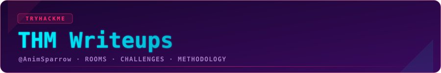

<p align="center">
  
</p>

<p align="center">
  
  
  
</p>

---

My TryHackMe room & challenge writeups — solved, documented, and skinned in a consistent
synthwave-terminal style. Each writeup leads with the *why*, not just the commands.

## Writeups

| Room / Challenge | Category | Difficulty | Writeup |
|---|---|---|---|
| AI & Automation in Detection Engineering | Detection Engineering | Medium | [→ read](writeups/ai-automation-detection-eng.md) |

<!-- Add new rows above. One .md per room in writeups/, banner in assets/banners/. -->

## Repo structure

```
thm-writeups/
├── README.md                     # this index
├── assets/
│   ├── hero-banner.svg           # repo hero
│   ├── more_writeups.svg         # footer button
│   └── banners/                  # one title banner per writeup
│       └── ai-automation-detection-eng.svg
└── writeups/                     # one markdown writeup per room
    └── ai-automation-detection-eng.md
```

---

<p align="center">
  <a href="https://github.com/AnimSparrow">
    
  </a>
</p>
